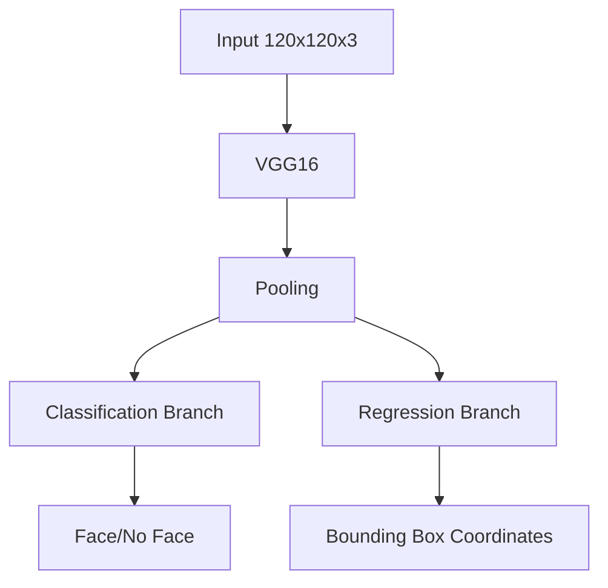

# Real-Time Face Detection and Tracking System
A deep learning-based face detection system that performs real-time face localization using a custom CNN architecture with VGG16 backbone. The model predicts both face presence (classification) and bounding box coordinates (regression) for accurate face tracking.
Overview
This project implements a dual-output neural network that simultaneously:

Classifies whether a face is present in the frame
Localizes the face by predicting bounding box coordinates

The system uses **transfer learning with VGG16** as the feature extractor and **custom dense layers for classification and regression tasks.**

## Features -
- Real-time face detection via webcam feed
- Custom data augmentation pipeline using Albumentations
- Dual-task learning with combined classification and localization loss
- VGG16 backbone for robust feature extraction
- Live bounding box visualization on detected faces

## Architecture -
### Model Overview

## Dataset Preparation
### Data Collection

Capture images using webcam (30 images)
Annotate images using LabelMe for bounding boxes
Organize into train/test/val splits

### Data Augmentation
#### Applied transformations using Albumentations:

- Random cropping (450x450)
- Horizontal and vertical flips
- Random brightness/contrast adjustment
- Random gamma correction
- RGB channel shifting
- 60x augmentation per image

### Final dataset: 3,840 training images, 720 test images, 660 validation images
